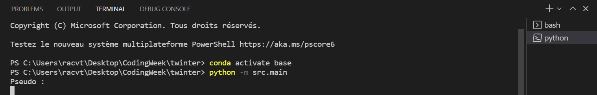
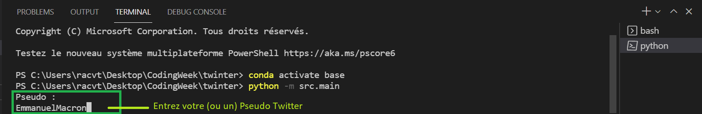
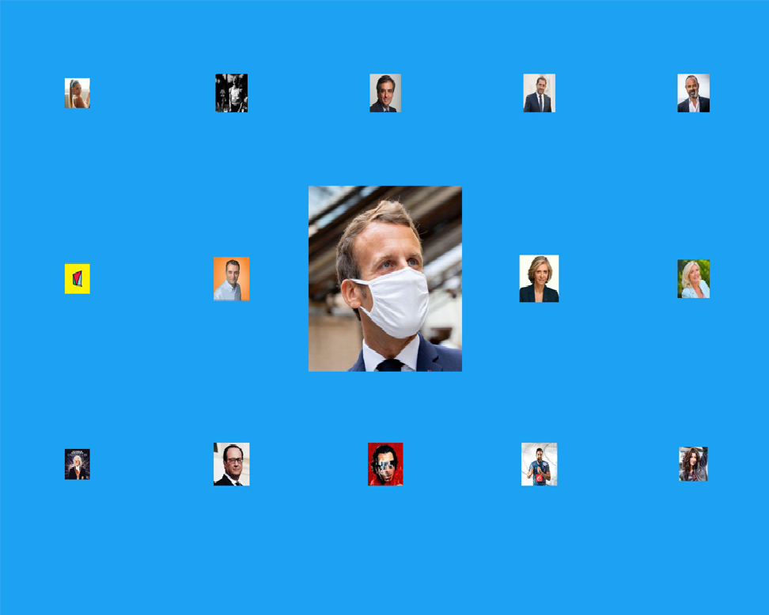

# Twinter


## Description du projet:

TWINTER renvoie à un utilisateur donné une mosaïque de photos de profil de personnalités françaises qui ressemblent le plus à l'utilisateur (grâce aux mots-clés récurrents et à la polarité). La taille des photos de profil sera proportionnelle au degré de ressemblance entre l'utilisateur et la personnalité en question.

## Comment installer notre projet:

Pour éxécuter le projet, il faut vous créer un compte Twitter Developer. Pour cela créez un compte Twitter si ce n'est pas déjà fait. Rendez-vous ensuite sur le site [TwitterDeveloper](https://developer.twitter.com/) et postulez pour avoir un compte développeur. Cette démarche peut prendre du temps!

Dans Data\Credentials, ajouter un fichier credentials.py contenant:
* **CONSUMER_KEY**: votre 'API KEY', sous forme de string.
* **CONSUMER_SECRET**: votre 'API Secret', sous forme de string.
* **ACCESS_TOKEN**: sous forme de string.
* **ACCESS_SECRET**: sous forme de String.

Nous utilisons dans ce projet plusieurs bibliothèques (vérifiez si elles sont bien installées):

* [Tweepy](https://www.tweepy.org/): ```
pip install tweepy```
* [TextBlob](https://textblob.readthedocs.io/en/dev/): ```
pip3 install textblob```
* [Dash](https://dash.plotly.com/): ```
pip install dash```
* [Dash_html_components](https://dash.plotly.com/dash-html-components): `pip install dash-html-components`  puis  `import dash_html_components as html`
* [Dash_bootstrap_components](https://dash-bootstrap-components.opensource.faculty.ai/): `pip install dash-bootstrap-components`  puis  `import dash_bootstrap_components as dbc`

Si votre éditeur de code a du mal à importer `dash-html-components` et `dash-bootstraps-components`, vous pouvez vous référer à cette page [StackOverflow](https://stackoverflow.com/questions/60021936/dash-bootstrap-components-installed-succesfully-but-no-recognised).

## Comment éxécuter TWINTER:

Dans un "powershell" éxécutez la ligne de code suivante : `python -m src.main`:




Puis entrez votre (ou un pseudo Twitter):




Enfin vous obtener une image mosaïque des profils qui vous correspondent le plus, les photos de profile les plus grandes vous correspondant le mieux:



## L'équipe du projet TWINTER

* Cavalier Pierre
* Frohly Eliott
* Leblanc Nathanael
* Duboc Bartholomé
* Raphael Trogneux
* Raphael Le Nadan